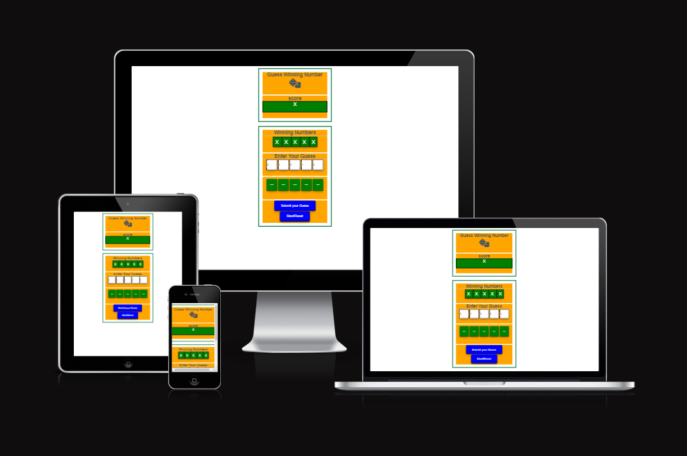
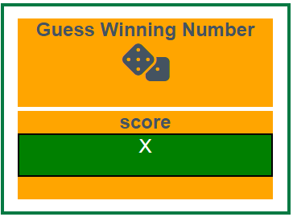
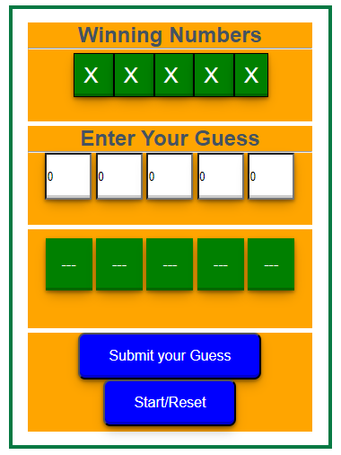
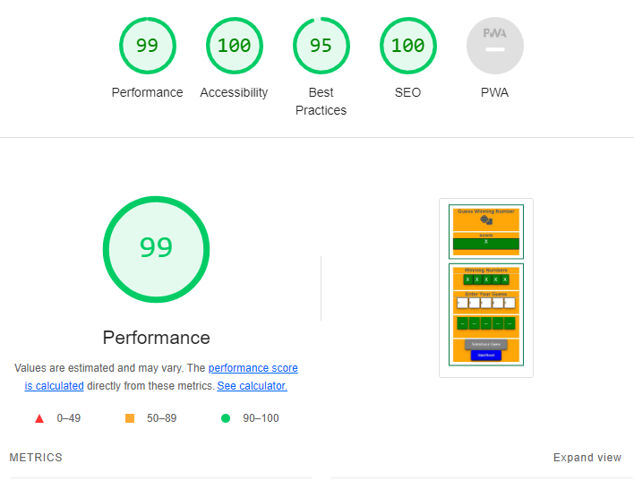

# Game Guess 5 
The game is 5 digits game. the number comprised between 0 -9 for beguinner. in the next version we will add options to increase the choices to  0 - 20  for average players  and  to 0 - 50 / 0 - 100 for experts players. It is designed to help teens with lagical thinking. A player must use the following hints ">>" and "<< " to predict their next guess. If used properly a player should be able to narrow down the right guess in a maximum of 4 attempt.  

The live link can be found here - [Game_Guess_5](https://d9fal.github.io/Guess-Number-PPT-2-/)

## Site Owner Goals
- To provide the user with basic thinking and Problem Solving Skills.
- To build the love for math. 
- To promote Student Engagement. 
- To deepen the player's understanding of numbers.

## User Stories

- ### First time user
  - As a first time user I want to understand the main purpose of the game.   
  - As a first time user I want to able to have positive experience therefore the game should give a clear path to win. 
  - As a first time user I want to be able to connect to connect 

- ### Returning User
  - As a returning user I want to easily save the score at the end of the game and return to improve the score.  
  - As a returning user I want to find step by step instructions to how to become an expert.

- ### Frequent User
  - As a frequent user I want to be able to overcome the chalenges and be able to compare my scores with others players.
  - As a frequent user I want to be able to change the number of player.

## Design

### Imagery

No imagery is used in this project. We are still searching for a good picture to bring the user interest and keep him motivated while playing.
### Colours

The color scheme of the game is orange, green and blue providing a good balance between keep the player engaged and relaxed. 

### Fonts

Raleway is the main font in the game. This font was imported via [Google Fonts](https://fonts.google.com/) . I'm using Sans Serif as a backup font, in case for any reason the main font isn't being imported into the site correctly.

## Wireframes

## Features
   - Score section is designed to show first the name of the game (with quick desription/objectives) and the score table. 

   - The game area section is where the player interact with the GUI. It comprised the hidden winning Number , the "Entre Your Guess" section  and THe hint bar . The "Submit your Guess" and "Start/Reset" are at the bottom  of the game area.  

## Testing

### Validator Testing

* HTML
  * No errors were returned using W3C html Validator
    * [w3w html Validator Results](https://validator.w3.org/nu/#textarea)
* CSS
  * No errors were returned using W3C css Validator
    * [w3w css Validator Results](https://jigsaw.w3.org/css-validator/validator)
* JS
    * No Errors were returned using jshint checker.
    *  - [W3C Validator Results](https://jshint.com/)

* Accessibility
  
  

  
The accessibility score is 100% showing that colors and fonts offers a good contrast. It is the result of searching on google.com colors combinations for game design. 

### Functions Testing
- All the functions and buton clicked events were tested and worked really good  
### Browser Testing
- The game was opened in firefox, chrome, microsoft edge, safari with no error.

### Device Testing

- The responsiveness test was conducted on iphone 12, thinkpad, desktop samsung 8, ipad and the results are satisfying.

## Friends and Family User Testing
 - The Game and documentation were reviewed by Friends and family members to point out any bugs and/or user experience issues. I received suggestion on other combition of colors. 

## Bugs
 - During the programming, errors and bugs were dealt with as it progress. google chrome dev tool "inspect" was used. We are planning to design a serie of test for the website. 

## Teshnologies Used
- HTML5
- CSS
- JS JavaScript

## Deployment

This project was deployed using GitHub pages. The steps are as followed:

* Click on "Settings" on the GitHub repository page.
* Select "Pages" on the left menu bar.
* Make sure "Main" is selected in "Branch" dropdowm menu under "Source". 
* Click "Save" .
* Wait a few minutes (2mn - 4mn ) and Under "Environements" click on "deployments" and the Deployment link should be available. 

The live link is [Hausarztpraxis](https://d9fal.github.io/Guess-Number-PPT-2-/)

## Frameworks - Librairies - Programs Used

- [Codeanywhere](https://codeanywhere.com/) - used as IDE to write, edit and compile the code.
- [W3C](https://validator.w3.org/) - To validate HTML & CSS.
- [jshint](https://jshint.com/) to check error with javascript
- [Chrome Dev Tools](https://developer.chrome.com/docs/devtools) - Used to test, verify, modify thewebsite while writting the program in codeanywhere   and tweaking,   including testing responsiveness and performance.
- [GitHub](https://github.com/) - Used for version control and hosting.
- [Am I Responsive](https://amiresponsive.co.uk/) - Used to verify responsiveness of website on different devices.
- [Google Fonts](https://fonts.google.com/) - Used to import and alter fonts on the page.
- [Font Awesome](https://fontawesome.com/) - Used for icons in footer.

## Ressources Used
- stack Overflow
- geesforgeeks
- W3Schools
- To structure my readme.md, I used my previous project 1. 

## Aknowledgments

My Mentor Antonio for the 3 productive sessions we had. 